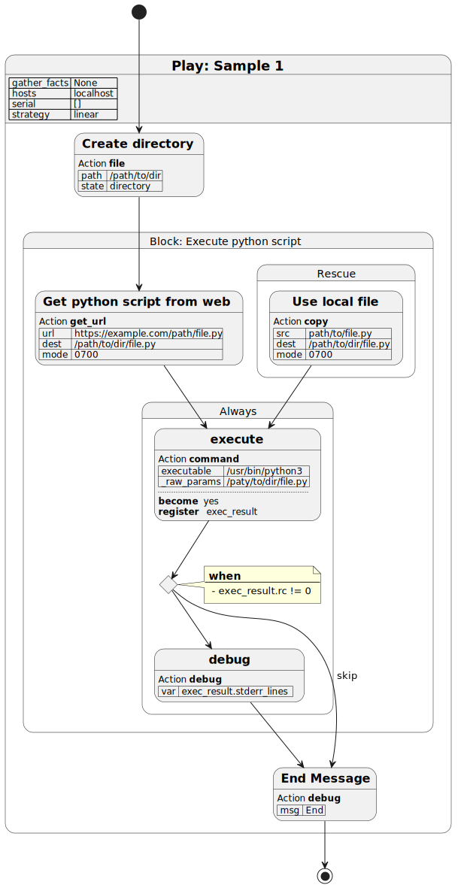

# playbook2uml
Ansible-playbook/role to PlantUML

## Usage

```
usage:
    playbook2uml [options] PLAYBOOK
    playbook2uml [options] -R ROLE_NAME [BASE_DIR]


Ansible playbook/role to PlantUML

optional arguments:
  -h, --help            show this help message and exit
  -T TITLE, --title TITLE
                        The title of the playbook/role
  --theme THEME         PlantUML theme
  --left-to-right       left to right direction
  -v, --verbose         Show information to STDERR. -v => INFO -vv => DEBUG

Playbook:
  Generate a graph of the playbook

  PLAYBOOK              playbook file

Role:
  Generate a graph of the role only

  -R ROLE, --role ROLE  The role name
  BASE_DIR              The base directory.[default=current directory]
```

The PlantUML code is out to stdout.
```console
$ playbook2uml path/to/playbook.yml --title "hello_world.yml"
@startuml
title hello_world.yml
state "= Play: Hello playbook2uml" as play_1 {
    play_1 : | hosts | localhost |
    play_1 : | gather_facts | False |
    state "== Hello playbook2uml" as task_1
    task_1 : Action **debug**
    task_1 : | msg | Hello ansible playbook to UML |
}
[*] --> task_1
task_1 --> [*]
@enduml
```

You maybe pipe to a PlantUML server with `curl`.
```sh
playbook2uml path/to/playbook.yml --title "Sample 1" | \
    curl --data-binary @- http://plantuml-server.example.com/svg/ -o - > path/to/foo.svg
```

## Output



## Requirements

- `ansible` >= 2.9

## Install

```sh
pip install git+https://github.com/teramako/playbook2uml
```
