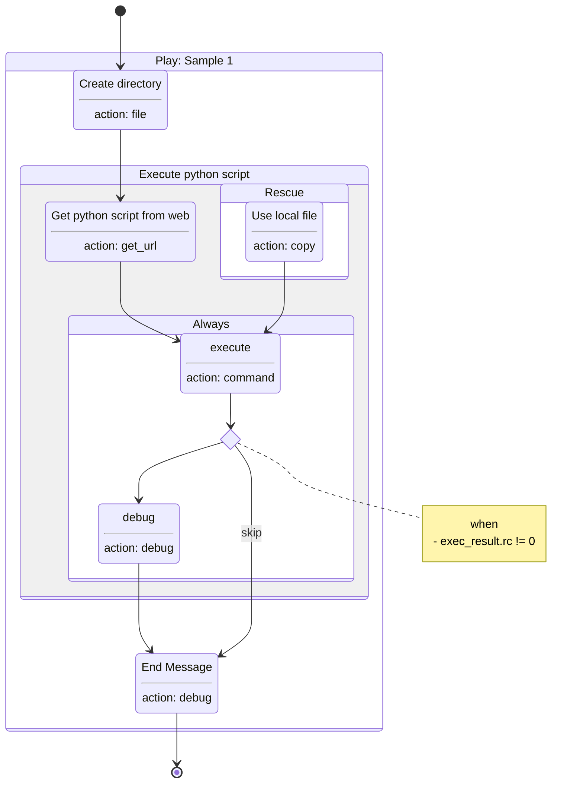

# playbook2uml
Ansible-playbook/role to PlantUML or Mermaid.js diagram

⚠️: Mermaid.js feature is *experimental* now.

## Usage

```
usage:
    playbook2uml [options] PLAYBOOK
    playbook2uml [options] -R ROLE_NAME [BASE_DIR]


Ansible playbook/role to PlantUML or Mermaid.js diagram

optional arguments:
  -h, --help            show this help message and exit
  -t {plantuml,mermaid}, --type {plantuml,mermaid}
                        The diagram type.[default=plantuml]
  -T TITLE, --title TITLE
                        The title of the playbook/role
  --theme THEME         PlantUML theme
  --left-to-right       left to right direction
  -v, --verbose         Show information to STDERR. -v => INFO -vv => DEBUG

Playbook:
  Generate a graph of the playbook

  PLAYBOOK              playbook file

Role:
  Generate a graph of the role only

  -R ROLE, --role ROLE  The role name
  --tasks-from TASKS_FROM
                        File to load from a role's tasks/ directory.
  BASE_DIR              The base directory.[default=current directory]
```

### PlantUML
The PlantUML code is out to stdout.
```console
$ playbook2uml path/to/playbook.yml --title "hello_world.yml"
@startuml
title hello_world.yml
state "= Play: Hello playbook2uml" as play_1 {
    play_1 : | hosts | localhost |
    play_1 : | gather_facts | False |
    state "== Hello playbook2uml" as task_1
    task_1 : Action **debug**
    task_1 : | msg | Hello ansible playbook to UML |
}
[*] --> task_1
task_1 --> [*]
@enduml
```

You maybe pipe to a PlantUML server with `curl`.
```sh
playbook2uml path/to/playbook.yml --title "Sample 1" | \
    curl --data-binary @- http://plantuml-server.example.com/svg/ -o - > path/to/foo.svg
```

#### Output (PlantUML)


### Mermaid.js

```console
$ playbook2uml path/to/playbook.yml -t mermaid
stateDiagram-v2
    state "Play: Sample 1" as play_1 {
        state "Create directory<hr>action: file" as task_1
        block_1 : Execute python script
        state block_1 {
            state "Get python script from web<hr>action: get_url" as task_2
            block_1_always : Always
            state block_1_always {
                state "execute<hr>action: command" as task_3
                state task_4_when <<choice>>
                note right of task_4_when
                    when
                     - exec_result.rc != 0
                end note
                state "debug<hr>action: debug" as task_4
            }
            block_1_rescue : Rescue
            state block_1_rescue {
                state "Use local file<hr>action: copy" as task_5
            }
        }
        state "End Message<hr>action: debug" as task_6
    }
    [*] --> task_1
    task_1 --> task_2
    task_2 --> task_3
    task_3 --> task_4_when
    task_4_when --> task_4
    task_4 --> task_6
    task_4_when --> task_6 : skip
    task_5 --> task_3
    task_6 --> [*]
```

#### Output (Mermaid.js)



## Requirements

- `ansible` >= 2.9

## Install

```sh
pip install git+https://github.com/teramako/playbook2uml
```
